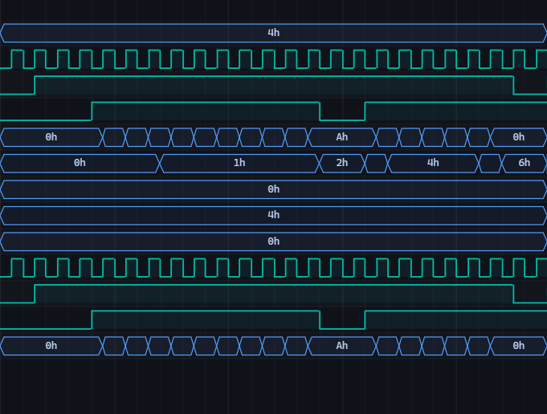

# [counter1] 11. Design N-bit Synchronous Counter with Enable and Reset

| Property | Value |
|----------|-------|
| **Language** | SystemVerilog |
| **Solved** | March 31, 2026 |
| **Platform** | [LeetSilicon](https://leetsilicon.com/?view=question&question=counter1) |

## Files

| File | Type |
|------|------|
| [`rtl/design.sv`](rtl/design.sv) | RTL Design |
| [`dv/testbench.sv`](dv/testbench.sv) | Testbench |

## Simulation Results

| Metric | Value |
|--------|-------|
| **Status** | ✅ Passed |
| **Tests** | 7 passed, 0 failed |
| **Max Cycles** | 10 |
| **Lint Warnings** | 0 |

## Waveforms

---
*Auto-synced by [SiliconHub](https://github.com) · March 31, 2026*
